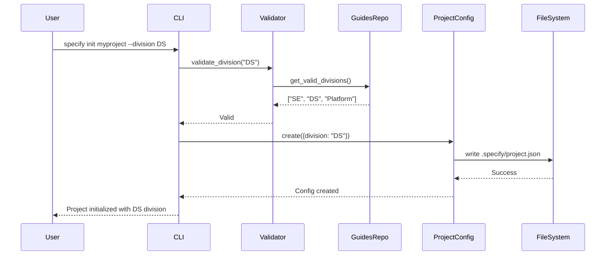
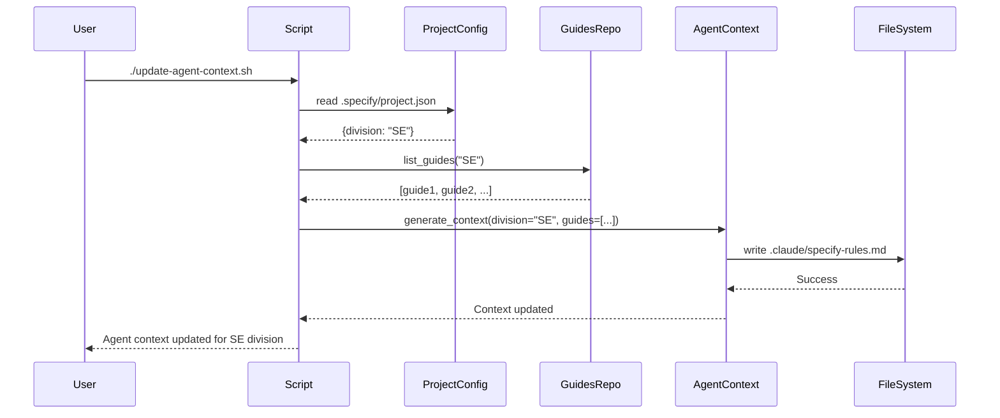
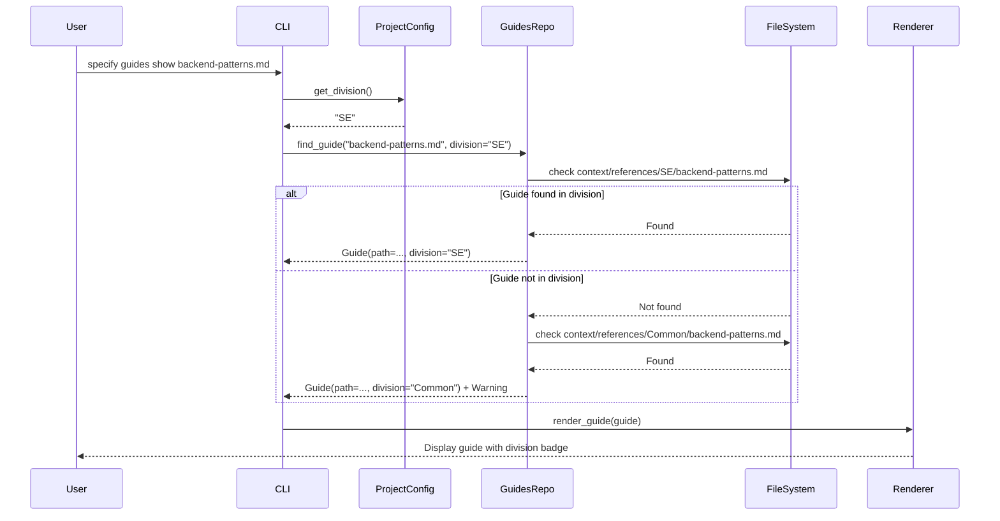

# Data Model: Division-Aware Workflow

**Feature**: Division-Aware Workflow  
**Date**: October 21, 2025  
**Status**: Phase 1 - Design Complete

## Overview

This document defines the data structures, entities, and relationships for the Division-Aware Workflow feature. The model is intentionally simple, following YAGNI principles while remaining extensible for future enhancements.

---

## Core Entities

### 1. ProjectConfig

**Purpose**: Stores project-level configuration including division designation

**Storage**: `.specify/project.json` file in project root

**Schema**:
```json
{
  "division": "SE"
}
```

**Fields**:
| Field | Type | Required | Default | Validation | Description |
|-------|------|----------|---------|------------|-------------|
| `division` | string | Yes | "SE" | Must match valid division list | Project's designated division (SE, DS, Platform, etc.) |

**Validation Rules**:
- ✅ `division` must be non-empty string
- ✅ `division` must be in list of valid divisions from guides repository
- ✅ Invalid divisions rejected with error listing valid options
- ✅ File must be valid JSON (corrupted JSON defaults to SE with warning)

**State Transitions**:
```
[No config file] --specify init--> [division: "SE" (default)]
                 --specify init --division DS--> [division: "DS"]
[division: "SE"] --manual edit--> [division: "DS"]
[division: "DS"] --specify init --here--> [division updated if --division provided]
```

**Backward Compatibility**:
- Missing file → defaults to "SE"
- Corrupted JSON → defaults to "SE" with warning logged
- Additional fields in JSON → preserved (forward compatibility)

---

### 2. Division

**Purpose**: Represents a project division with associated guides and standards

**Storage**: Implicitly defined by directory structure in `context/references/<DIVISION>/`

**Fields**:
| Field | Type | Required | Description |
|-------|------|----------|-------------|
| `name` | string | Yes | Division identifier (e.g., "SE", "DS", "Platform") |
| `display_name` | string | No | Human-readable name (e.g., "Software Engineering") |
| `guides_path` | Path | Yes | Directory path to division's guides (`context/references/{name}/`) |
| `guide_count` | int | No | Number of guides in division (computed) |

**Relationships**:
- One ProjectConfig has one Division (many-to-one)
- One Division has many Guides (one-to-many)

**Discovery**:
Divisions are discovered dynamically by scanning `context/references/` for subdirectories:
```python
valid_divisions = [
    d.name for d in (guides_repo / "context/references").iterdir()
    if d.is_dir() and not d.name.startswith(".")
]
```

**Hardcoded Fallback** (when guides repo not available):
```python
DEFAULT_DIVISIONS = ["SE", "DS", "Platform"]
```

---

### 3. Guide

**Purpose**: Represents a single implementation guide or reference document

**Storage**: Markdown files in `context/references/<DIVISION>/<guide-name>.md`

**Fields**:
| Field | Type | Required | Description |
|-------|------|----------|-------------|
| `path` | Path | Yes | Full file path to guide |
| `relative_path` | str | Yes | Path relative to `context/references/` (e.g., "SE/backend-patterns.md") |
| `name` | str | Yes | File name without extension (e.g., "backend-patterns") |
| `division` | str | Yes | Division owning this guide (e.g., "SE") |
| `title` | str | No | Guide title extracted from first H1 in Markdown |
| `content` | str | No | Full guide content (loaded on demand) |
| `size` | int | No | File size in bytes |
| `modified` | datetime | No | Last modification timestamp |

**Relationships**:
- One Guide belongs to one Division (many-to-one)

**Search Priority**:
Given project division "SE", search order:
1. `context/references/SE/{query}`
2. `context/references/Common/{query}` (if Common directory exists)
3. `context/references/*/{query}` (other divisions, with warning)

---

### 4. AgentContext

**Purpose**: Context information passed to AI agents via context scripts

**Storage**: Agent-specific files (`.claude/`, `.github/`, etc.)

**Generated Content**:
```markdown
## Project Division

**Division**: SE  
**Guide Priority**: Guides from `context/references/SE/` should be prioritized in recommendations.

## Available Guides (SE Division)

- context/references/SE/backend-patterns.md
- context/references/SE/api-design.md
- context/references/SE/testing-strategy.md

## Available Guides (Common)

- context/references/Common/git-workflow.md

## Available Guides (Other Divisions)

- context/references/DS/data-pipelines.md (Data Science)
- context/references/Platform/infrastructure.md (Platform Engineering)
```

**Fields**:
| Field | Type | Description |
|-------|------|-------------|
| `division` | str | Current project division |
| `division_guides` | List[str] | Paths to guides in project's division |
| `common_guides` | List[str] | Paths to common guides (all divisions) |
| `other_guides` | Dict[str, List[str]] | Paths to guides in other divisions (keyed by division) |

**Relationships**:
- One ProjectConfig generates one AgentContext per AI agent type

---

## Data Flow

### Initialize Project with Division



### Update Agent Context with Division



### Display Division-Specific Guide



---

## File System Structure

```
project-root/
├── .specify/
│   └── project.json          # ProjectConfig: {"division": "SE"}
└── context/
    └── references/            # Guides repository
        ├── SE/                # Division: Software Engineering
        │   ├── backend-patterns.md
        │   ├── api-design.md
        │   └── testing-strategy.md
        ├── DS/                # Division: Data Science
        │   ├── data-pipelines.md
        │   ├── ml-models.md
        │   └── notebooks.md
        ├── Platform/          # Division: Platform Engineering
        │   ├── infrastructure.md
        │   ├── kubernetes.md
        │   └── monitoring.md
        └── Common/            # Common guides (all divisions)
            ├── git-workflow.md
            └── code-review.md
```

---

## API Contracts

### Python Module: `specify_cli.config`

```python
class ProjectConfig:
    """Manages .specify/project.json configuration file."""
    
    @staticmethod
    def read(project_root: Path) -> dict:
        """Read project configuration.
        
        Args:
            project_root: Path to project root directory
            
        Returns:
            dict: Project configuration with 'division' key
            
        Raises:
            None - returns default {"division": "SE"} on error
        """
    
    @staticmethod
    def write(project_root: Path, division: str) -> None:
        """Write project configuration.
        
        Args:
            project_root: Path to project root directory
            division: Division identifier to store
            
        Raises:
            OSError: If file cannot be written
            ValueError: If division is invalid
        """
    
    @staticmethod
    def get_division(project_root: Path) -> str:
        """Get division for project (convenience method).
        
        Args:
            project_root: Path to project root directory
            
        Returns:
            str: Division identifier (defaults to "SE" if not found)
        """

class DivisionValidator:
    """Validates division identifiers against guides repository."""
    
    @staticmethod
    def get_valid_divisions(guides_path: Path) -> list[str]:
        """Discover valid divisions from guides directory structure.
        
        Args:
            guides_path: Path to context/references directory
            
        Returns:
            list[str]: Sorted list of valid division identifiers
        """
    
    @staticmethod
    def validate(division: str, guides_path: Path) -> bool:
        """Check if division is valid.
        
        Args:
            division: Division identifier to validate
            guides_path: Path to context/references directory
            
        Returns:
            bool: True if valid, False otherwise
        """

class GuideDiscovery:
    """Discovers and filters guides by division."""
    
    @staticmethod
    def find_guide(
        name: str,
        division: str,
        guides_path: Path
    ) -> Optional[Path]:
        """Find guide prioritizing specified division.
        
        Args:
            name: Guide file name (with or without .md)
            division: Division to prioritize
            guides_path: Path to context/references directory
            
        Returns:
            Optional[Path]: Path to guide file, or None if not found
        """
    
    @staticmethod
    def list_guides(
        division: str,
        guides_path: Path
    ) -> dict[str, list[Path]]:
        """List all guides organized by division.
        
        Args:
            division: Project's division (for prioritization)
            guides_path: Path to context/references directory
            
        Returns:
            dict: Keys are 'primary', 'common', 'other' with guide paths
        """
```

### Bash Script Functions

```bash
# Get project division from .specify/project.json
# Returns: Division string (defaults to "SE")
get_project_division() {
    local config_file=".specify/project.json"
    if [ -f "$config_file" ]; then
        jq -r '.division // "SE"' "$config_file" 2>/dev/null || echo "SE"
    else
        echo "SE"
    fi
}

# List guides for specified division
# Args: $1 = division name, $2 = guides root path
# Returns: Newline-separated list of guide paths
list_division_guides() {
    local division="$1"
    local guides_root="$2"
    
    if [ -d "$guides_root/$division" ]; then
        find "$guides_root/$division" -name "*.md" -type f
    fi
}
```

### PowerShell Script Functions

```powershell
# Get project division from .specify/project.json
# Returns: Division string (defaults to "SE")
function Get-ProjectDivision {
    $configFile = ".specify/project.json"
    if (Test-Path $configFile) {
        try {
            $config = Get-Content $configFile | ConvertFrom-Json
            return $config.division ?? "SE"
        } catch {
            return "SE"
        }
    }
    return "SE"
}

# List guides for specified division
# Args: division name, guides root path
# Returns: Array of guide paths
function Get-DivisionGuides {
    param($Division, $GuidesRoot)
    
    $divisionPath = Join-Path $GuidesRoot $Division
    if (Test-Path $divisionPath) {
        Get-ChildItem -Path $divisionPath -Filter "*.md" -Recurse
    }
}
```

---

## Validation Matrix

| Scenario | Input | Validation | Output | Error Handling |
|----------|-------|------------|--------|----------------|
| Valid division | `--division SE` | Division in valid list | Config created with SE | None |
| Default division | No `--division` flag | N/A | Config created with SE | None |
| Invalid division | `--division XYZ` | Division not in valid list | Error message | Lists valid options, exits 1 |
| Missing config | Read `.specify/project.json` | File doesn't exist | Returns "SE" default | Logs info message |
| Corrupted JSON | Read `.specify/project.json` | JSON parse error | Returns "SE" default | Logs warning |
| Invalid division in file | Read `.specify/project.json` | Division not in valid list | Returns "SE" default | Logs warning |
| Permission error | Write `.specify/project.json` | File system error | Exception raised | Shows error message |
| Guide not found | `specify guides show missing.md` | File doesn't exist | Error message | Suggests fuzzy matches if any |

---

## Extension Points

The data model is designed for future extensibility:

### Additional ProjectConfig Fields

```json
{
  "division": "SE",
  "created": "2025-10-21T10:30:00Z",
  "team": "backend-platform",
  "guides_version": "v2.1.0"
}
```

### Division Metadata

Future: divisions could have metadata files:

```
context/references/SE/.division.json
{
  "display_name": "Software Engineering",
  "description": "Backend and frontend application development",
  "guide_count": 15,
  "owner": "architecture-team"
}
```

### Guide Metadata

Future: guides could have frontmatter:

```markdown
---
title: Backend Patterns
division: SE
tags: [architecture, patterns, backend]
updated: 2025-10-15
---

# Backend Patterns

...content...
```

---

## Summary

The data model is intentionally minimal:
- ✅ **ProjectConfig**: Single JSON file with division string
- ✅ **Division**: Implicitly defined by directory structure
- ✅ **Guide**: Markdown files in division directories
- ✅ **AgentContext**: Generated content for AI agents

No complex relationships, no database, no ORM - just simple file-based storage that aligns with version control and the existing Specify CLI architecture.

**Next**: Create API contracts and quickstart guide.
